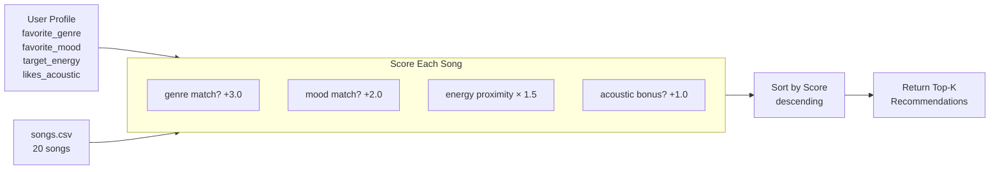

# 🎵 Music Recommender Simulation

## Project Summary

This project simulates how a content-based music recommendation engine works — the kind that powers "Discover Weekly" or TikTok's For You page. Rather than relying on what other users listen to, it scores each song against a single user's taste profile using weighted attributes like genre, mood, and energy level. The result is a ranked list of songs most likely to match that user's current vibe.

---

## How The System Works

### Real-World Context

Platforms like Spotify and YouTube use two main approaches to recommendations. **Collaborative filtering** looks at patterns across millions of users — if people who like what you like also tend to love a certain song, you get that song suggested. **Content-based filtering** ignores other users entirely and instead analyzes the song itself — its tempo, energy, genre, and mood — and compares those attributes directly to a user's known preferences. Most production systems (including Spotify's) blend both. This simulation focuses purely on content-based filtering, which is easier to reason about and audit for bias.

### This System's Approach

The core idea is a **weighted score**: each song gets a relevance number between 0 and 1, and the top-k songs by score are returned as recommendations. The scoring logic rewards songs that are close to the user's preferences, not just songs that have generically "good" attributes.

### Features Used

**`Song` attributes:**
| Feature | Type | Role in scoring |
|---|---|---|
| `genre` | string | Categorical match — biggest weight, defines the core style |
| `mood` | string | Categorical match — second largest weight, defines emotional tone |
| `energy` | float (0–1) | Proximity score — rewards closeness to user's target energy |
| `acousticness` | float (0–1) | Boolean-style bonus — rewarded if user prefers acoustic sound |
| `tempo_bpm` | float | Available for future scoring (not used in v1) |
| `valence` | float (0–1) | Available for future scoring (not used in v1) |
| `danceability` | float (0–1) | Available for future scoring (not used in v1) |

**`UserProfile` fields:**
| Field | Type | Purpose |
|---|---|---|
| `favorite_genre` | string | Compared against `Song.genre` for match bonus |
| `favorite_mood` | string | Compared against `Song.mood` for match bonus |
| `target_energy` | float (0–1) | Energy proximity calculation anchor |
| `likes_acoustic` | bool | If `True`, songs with `acousticness > 0.6` get a bonus |

### Scoring Rule (one song)

```
score = 0

if song.genre == user.favorite_genre:
    score += 3.0   # genre match — highest weight

if song.mood == user.favorite_mood:
    score += 2.0   # mood match — second highest weight

score += (1 - abs(song.energy - user.target_energy)) * 1.5   # energy proximity

if user.likes_acoustic and song.acousticness > 0.6:
    score += 1.0   # acoustic bonus
```

### Ranking Rule (full catalog)

All songs are scored using the rule above, then sorted descending by score. The top-k are returned. A "Scoring Rule" applies to a single song in isolation — it answers "how relevant is *this* song?" A "Ranking Rule" applies across the full catalog — it answers "which songs are *most* relevant?" Both are necessary: without scoring you have no basis for comparison, and without ranking you can't choose what to surface.

### Sample User Profile

```python
UserProfile(
    favorite_genre="lofi",
    favorite_mood="chill",
    target_energy=0.40,
    likes_acoustic=True
)
```

This profile can differentiate between songs effectively: a lofi/chill song with 0.38 energy would score ~6.5 points, while an intense rock song at 0.91 energy would score only ~0.6 points — the gap is wide enough to produce a meaningful ranked list. A profile that stored only `likes_high_energy=True` would fail to distinguish "intense rock" from "intense pop," which shows why genre and mood need to be separate categorical fields rather than collapsed into a single energy boolean.

### Data Flow



### Known Biases in This Design

- **Genre dominance**: At 3.0 points, a genre match outweighs all other signals combined in some cases. A great mood+energy match from the wrong genre will always lose to a poor energy match from the right genre. This creates a "filter bubble" effect — users who prefer lofi will almost never see jazz, even if a jazz track matches their vibe perfectly.
- **Mood label brittleness**: `"chill"` and `"relaxed"` are functionally similar moods but treated as completely different strings. A "relaxed" song gets zero mood credit for a "chill" user.
- **Acoustic threshold is binary**: Setting the cutoff at `acousticness > 0.6` means a song at 0.59 gets no bonus, while one at 0.61 does — even though they're essentially the same.
- **No diversity enforcement**: The ranking rule can return 5 songs that all sound nearly identical, which is how real "filter bubbles" form.

---

## Getting Started

### Setup

1. Create a virtual environment (optional but recommended):

   ```bash
   python -m venv .venv
   source .venv/bin/activate      # Mac or Linux
   .venv\Scripts\activate         # Windows

2. Install dependencies

```bash
pip install -r requirements.txt
```

3. Run the app:

```bash
python -m src.main
```

### Running Tests

Run the starter tests with:

```bash
pytest
```

You can add more tests in `tests/test_recommender.py`.

---

## Experiments You Tried

**Experiment 1 — Weight shift (genre 3.0→1.5, energy 1.5→3.0):**
For the High-Energy Pop profile, Neon Petals (k-pop) jumped from #3 to #2, bumping Gym Hero down to #4. A k-pop song outranked a pop song once genre became less dominant. This showed the system is highly sensitive to weight calibration — the weights are a policy choice, not a mathematical truth.

**Experiment 2 — Four diverse user profiles:**

| Profile | Top Result | Key Observation |
|---|---|---|
| High-Energy Pop | Sunrise City (6.46) | Large gap to #2 — only one pop/happy song in catalog |
| Chill Lofi Study | Library Rain (7.46) | Tight tie with #2 (7.44) — two near-identical lofi/chill songs |
| Deep Intense Rock | Storm Runner (6.48) | Catalog exhausted after 1 genre match; #2–5 are mood-only |
| Conflicted Listener | Spacewalk Thoughts (4.57) | Edge case: genre weight returned a 0.28-energy song to a user requesting 0.90 energy |

**Experiment 3 — Conflicting preferences (edge case):**
A profile requesting ambient genre + 0.90 energy exposed a fundamental flaw: the system has no way to detect internally contradictory preferences. Genre dominance means it confidently returns the wrong result.

---

## Limitations and Risks

- **Catalog too small for genre-based scoring.** With 1–3 songs per genre, the system frequently falls back to energy-only matching for anything outside the top 3 genres. Results #3–5 are often just "closest energy match in the catalog," not true recommendations.
- **Exact string matching for mood and genre.** "Chill" ≠ "relaxed" in this system, even though they are nearly identical emotions. This creates invisible dead zones for users whose preferred mood has no exact catalog match.
- **No memory or feedback.** Every recommendation run is stateless — the system cannot learn that a user skipped a song or played it 20 times. Real recommenders improve over time; this one does not.
- **Synthetic data attributes.** Energy, acousticness, and valence values were estimated by hand, not computed from actual audio. Results would not generalize to real music data from an API like Spotify's.
- **Single static taste profile.** Real listeners want different things at 7am vs 11pm. A fixed profile cannot capture that — the system recommends "gym music" to someone who just wants background noise, because their profile says high energy.

---

## Reflection

See the full [Model Card](model_card.md) for a complete breakdown of how the system works, its biases, and evaluation results.

**What this project revealed about recommenders:**
Building the scoring function made it concrete that recommendation systems are not discovering objective truth — they are enforcing the designer's judgment through numbers. Setting genre weight to 3.0 is a policy decision. Changing it to 1.5 produces different results for every single user. Real platforms (Spotify, TikTok, YouTube) make the same decisions, but at a scale where those choices affect what billions of people hear, discover, or never encounter.

**Where bias shows up in systems like this:**
The "filter bubble" is not a conspiracy — it's what happens when a correct algorithm optimizes for consistency rather than diversity. A lofi user gets lofi songs every time because that's what scores highest. The system never takes a risk on jazz or ambient, even if those genres might be exactly what that user would love. At scale, this means entire genres, languages, and cultures can be systematically underserved because they don't appear in the training data or don't have enough catalog representation to compete in the ranking.

